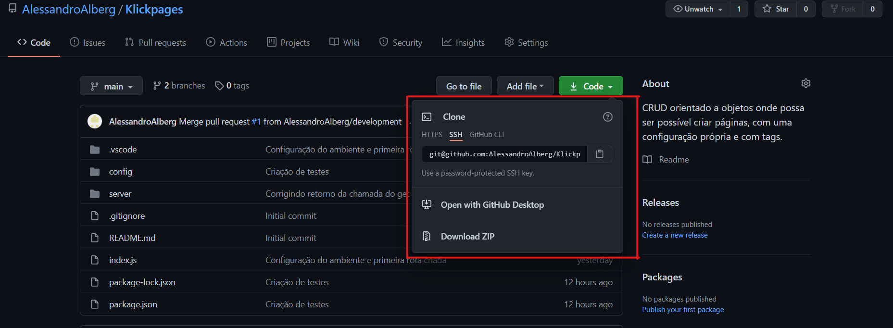
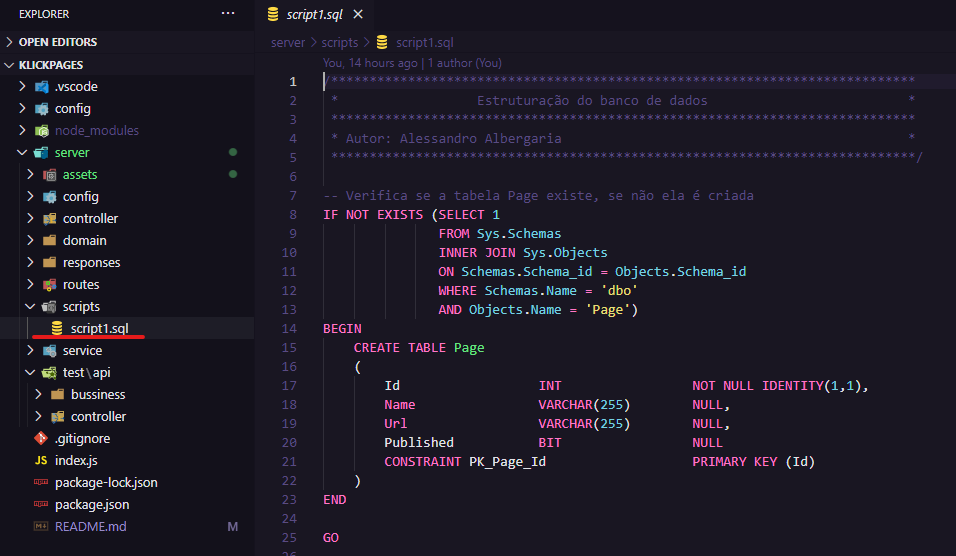
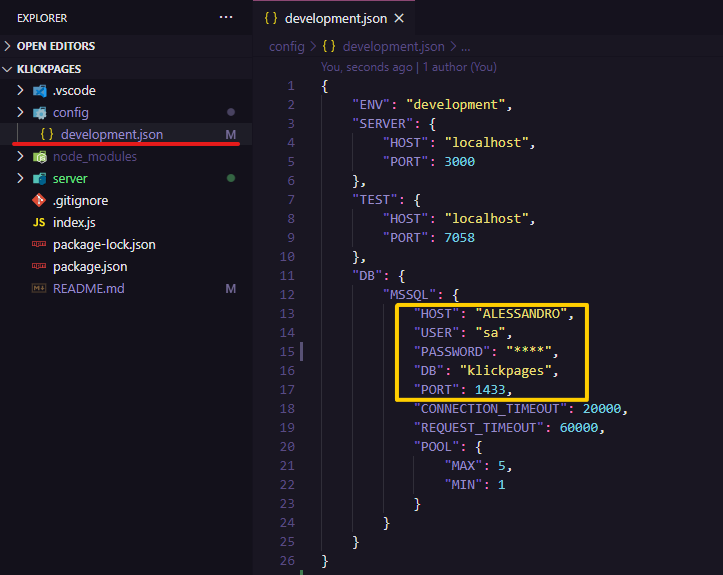

# Klickpages
CRUD orientado a objetos onde possa ser possível criar páginas, com uma configuração própria e com várias tags.

# Pré requisitos
- Git ([https://git-scm.com/](https://git-scm.com/))
- Node ([https://nodejs.org/](https://nodejs.org/))
- SQL Server ([https://www.microsoft.com/pt-br/sql-server/sql-server-downloads](https://www.microsoft.com/pt-br/sql-server/sql-server-downloads))

# Instalação
Para baixar e rodar na sua própria máquina o projeto é bem simples, é só seguir o passo-a-passo a seguir:

## Start
Partindo do princípio que vocês não estão familiarizados com o **Git**, **Node.js** ou **SQL Server**, então primeiro você precisa instalar o [Node.js](https://nodejs.org/) no seu pc, caso o seu pc seja **Windows** eu recomento estar utilizando o gerenciador de pacotes [Chocolatey](https://chocolatey.org/) para baixar o **Node.js** e todas as outras dependências. Após a instalação do **Node.js**, recomendo você baixar e instalar o **[Git](https://git-scm.com/)** e o [SQL Server](https://www.microsoft.com/pt-br/sql-server/sql-server-downloads) na sua máquina.

## Clonando o Repositório
Com o Git e o Node.js instalado na sua máquina, para pegar a **URL** do projeto é só clicar em **Code** no GitHub.



Com a **URL** do projeto em mãos, crie em algum lugar do seu pc uma pasta para criarmos uma cópia do repositório, dentro dela (Se você estiver utilizando o Windows) abra o **cmd** ou **powershell** e digite os comandos abaixo:

```
git clone git@github.com:AlessandroAlberg/Klickpages.git
cd Klickpages
npm install
```

## Banco de dados
Na pasta **script** existe o arquivo *script1.sql*, ao terminar de instalar seu banco de dados você pode estar rodando esse **script** no seu banco que ele irá criar as tabelas com as colunas para estar rodando sua **API**.



Para configurarmos o nosso banco de dados na **API** basta ir na pasta **config**, na raiz do projeto, e no arquivo *development.json* vamos substituir os campos de acordo com as configurações do seu banco:



## Executar API e Testes

Para a execução da nossa API basta executar o comando abaixo:

```
npm start
```

Já para executarmos os teste devemos executar o comando abaixo:

```
npm test
```

## Rotas HTTP

Na API existe 3 rotas HTTP:
- /page
- /setting
- /tag

Nas 3 rotas podemos fazer requisições HTTP de um CRUD:
**GET**
**POST**
**PUT**
**DELETE**
### Page
Na rota de Page temos:

**GET**
```
/page - Retorna todas as páginas cadastradas
/page/:id - Retorna a página que foi passado o parâmetro id

- Retorno
{
    id: int,
    name: string,
    url: string,
    published: boolean,
    settings: {
        settingId: int,
        title: string,
        description: string,
        language: string
    },
    [
        {
            id: int,
            pageId: int,
            name: string
        }
    ]
}
```

**POST**
```
/page - Cria uma página

- Parâmetros

body: {
    name: string,
    url: string,
    published: boolean
}

- Retorno
{
    id: int
}
```

**PUT**
```
/page - Atualiza uma página

Parâmetros

body: {
    id: int
    name: string,
    url: string,
    published: boolean
}

- Retorno
Página atualizada
```

**DELETE**
```
/page/:id - Deleta uma página

Parâmetros
id: int

- Retorno
Página deletada
```

### Setting
Na rota de Setting temos:

**GET**
```
/setting/:id - Retorna a configuração que foi passado o parâmetro id

- Retorno
{
    settingId: int,
    title: string,
    description: string,
    language: string    
}
```

**POST**
```
/setting - Cria uma configuração

- Parâmetros

body: {
    pageId: int,
    title: string,
    description: string,
    language: string    
}

- Retorno
{
    id: int
}
```

**PUT**
```
/setting - Atualiza uma configuração

Parâmetros

body: {
    id: int
    title: string,
    description: string,
    language: string 
}

- Retorno
Configuração atualizada
```

**DELETE**
```
/setting/:id - Deleta uma configuração

Parâmetros
id: int

- Retorno
Configuração deletada
```

### Tag
Na rota de Tag temos:

**GET**
```
/tag/all/:pageId - Retorna todas as tags do parâmetro pageId
/tag/:id - Retorna a tag que foi passado o parâmetro id

- Retorno
{
    id: int,
    pageId: int,
    name: string
}
```

**POST**
```
/tag - Cria uma tag

- Parâmetros

body: {
    pageId: int,
    name: string
}

- Retorno
{
    id: int
}
```

**PUT**
```
/tag - Atualiza uma tag

Parâmetros

body: {
    id: int,
    name: string
}

- Retorno
Tag atualizada
```

**DELETE**
```
/tag/:id - Deleta uma tag

Parâmetros
id: int

- Retorno
Tag deletada
```